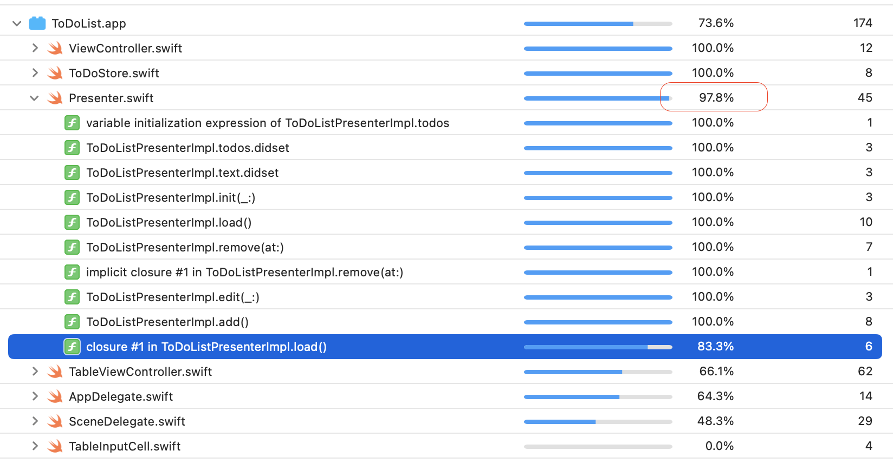

# Architecture

# TCA
[参考](https://www.fatbobman.com/posts/the_Composable_Architecture/)

要学习TCA, 先要了解一下redux-like的框架

## Redux-like
- unidirectional data flow(单向数据流) [guide](https://dev.to/aryclenio/unidirectional-and-bidirectional-data-flow-the-ultimate-front-end-interview-questions-guide-pt-1-5cnc)
```
有一篇文章拿输入框做例子, 对比单向数据流(react)和双向数据流的框架(vue), 有点清楚.

在react中, 数据更新是单向的, state更新触发view更新, 但是view更新不能反过来触发state更新, 因此在输入场景下要做到view输入修改state, 需要手动的处理view中输入框的回调, 手动updateState.

与之对比, 在vue中, state和view可以用`v-model`绑定, 这样在view的输入框中更新数据, state就会被同步更新.

很明显, SwiftUI中使用的就是这种bidirectional data flow, 双向数据流.

上面说的是单向vs双向的对比, 还有一个问题是这个为什么叫单向数据流, 是因为在这种模式在, model变化就必然引起view的变化, 这个框架内部支持的, 必定发生的, 与之对比的是model的变化需要手动更新view, 这种mode和view更新的分离在复杂页面中容易滋生bug. 这就好比mvc模式与mvvm模式, mvc中就不是单向数据流, 因为model更新并无法保证view的update, 而mvvm则保证了这一点, 是单向数据流的.
```

## 纯函数

给定输入就能确定输出, 该函数不依赖于外部变量.

# Architecture

[参考1](https://juejin.cn/post/6844903622275235848)
[参考2](https://blog.csdn.net/u014600626/article/details/119900761)
[原著](https://medium.com/ios-os-x-development/ios-architecture-patterns-ecba4c38de52)

> MVC, MVP, MVVM, VIPER

下面套用上面几个架构, 看看`MVC`中的问题是什么, 其他架构是如何解决这些问题的. 我要开发一个简单的`list`页面, 异步获取数据后, 可以本地添加, 删除, 功能如下:


## MVC
[源代码](https://github.com/zteshadow/best-practice/tree/main/native-ios/MVC)


```swift
override func tableView(_ tableView: UITableView, didSelectRowAt indexPath: IndexPath) {
        guard indexPath.section == Section.todos.rawValue else {
            return
        }
        
        todos.remove(at: indexPath.row)    //更新model
        title = "TODO - (\(todos.count))"  //更新model
        tableView.reloadData() //刷新View
    }

```

><span style="color:red">问题</span>
- 无法测试business logic是否正确, 包括:
```
1. 添加时`button`的`enabled`状态是否正确
2. 添加时新增的条目是否正确
3. 是否删除正确的条目
...
```
- View与business logic耦合在一起, 无法复用
```
1. 如果要换个界面展示business, 代码修改, 无法保证business不动只切换UI
```

> 优点
- 代码量少, 开发速度快
- 不需要太多经验就能开发维护

## MVP

[源代码](https://github.com/zteshadow/best-practice/tree/main/native-ios/MVP)

```swift
protocol ToDoListView: AnyObject {
    func update(list: [String], title: String)
    func enableAdd(_ enable: Bool)
}

protocol ToDoListPresenter {
    func load()
    func remove(at index: Int)
    func edit(_ text: String)
    func add()
}

class ToDoListPresenterImpl: ToDoListPresenter {
    unowned var view: ToDoListView

    var todos: [String] = [] {
        didSet {
            view.update(list: todos, title: "TODO - (\(self.todos.count))")
        }
    }
    var text = "" {
        didSet {
            view.enableAdd(text.count >= 3)
        }
    }

    init(_ view: ToDoListView) {
        self.view = view
    }
}
```

> Controller和Presenter的绑定:
```swift
...
let controller: TableViewController = UIStoryboard(name: "Table", bundle: nil)
    .instantiateViewController(withIdentifier: "tableViewController") as! TableViewController

let presenter = ToDoListPresenterImpl(controller)
controller.presenter = presenter

controller.navigationItem.hidesBackButton = true
self.navigationController?.pushViewController(controller, animated: false)
...
```
><span style="color:red">注意`view`持有`presenter`, 而`presenter`连接`unowned view`</span>

业务逻辑在`presenter`中, 很容易通过mock view进行测试(代码覆盖率达到`97.8`).


><span style="color:red">问题</span>
- 需要手动将数据的变化绑定到view
> 优点
- 业务逻辑与view隔离, 容易测试
- 业务逻辑与view隔离, 容易复用, 如果只修改界面, 换一个`ToDoListView`实现即可.

## MVVM
[源代码](https://github.com/zteshadow/best-practice/tree/main/native-ios/MVVM)


```swift
protocol ViewModel {
    var greeting: String? { get }
    func showGreeting() /// for view
    /// for manually binding
    var greetingDidChange: (ViewModel) -> Void { set get }
}

```

><span style="color:red">与MVP的区别</span>

-` view`与`view model`之间的数据交互是自动绑定完成的
> 优点
- 业务逻辑与view隔离, 容易测试
- 由controller和view组成的view部分可以复用

> 绑定的方式
- 手动(block回调)
- RxSwift
- ReactiveCocoa
- KVO

## VIPER

[源代码](https://github.com/zteshadow/newlife/tree/master/study/Architect/MVX/VIPER)


><span style="color:red">与MVP的区别</span>

- 将`Presenter`进一步的细化, 分拆出来`Interactor`和`Router`, 分别负责外部数据交互以及路由

## MVVMC


> Typical coordinator(统筹者,协调人)
```swift
public protocol MyTicketsCoordinator: Coordinator {
    /// Creates a new view to show for the home-page tab.
    func createMyTicketsView() -> AnyView
    /// or
    func pushMyTicketsScreen() -> ChildCoordinator
}

/// The MyTickets public APIs to be used by other modules
public protocol MyTicketsAPI {
    /// Creates a new coordinator for the home page.
    func createMyTicketsCoordinator(router: RoutingAPI) -> MyTicketsCoordinator
}

```
## 总结
架构的最终目的
- UI可复用可更新
- 业务逻辑可测试

# SOLID

> <span style="color:red">**S**</span>ingle responsibility/单一职责原则

> <span style="color:red">**O**</span>pen-close principle/开闭原则
- 对扩展open
- 对修改close
```
以third party login为例, 开始只支持apple sign in, 后来可能会加Facebook sign. 因此设计的时候就要考虑到, 再加新的sign in功能的时候, 不要修改代码, 而是要扩展.
```
> <span style="color:red">**L**</span>iskov substitution principle/里氏替换原则
- 子类可以替换父类使用, 这是用在继承设计中的原则
```
为了达到这个目的, 如果子类是为了复用父类的函数而继承, 那么就不要重写父类的函数. 如果是为了多态, 那么父类就搞成抽象类, 不能让父类有函数实现, 而子类又进行重写, 这样会造成父子之间强耦合.
```

> <span style="color:red">**I**</span>nterface segregation principle/接口隔离原则
- 不要添加不使用的接口 - 接口由使用者决定且越瘦越好不要臃肿
```swift
protocol BrickInterface {
    func buildHouse()
    func defense()
}
// not good, coz people use brick to defense while worker use brick to build house, better solution is here:
protocol Buildable {
    func buildHouse()
}
protocol Defensable {
    func defense()
}
extension Brick: Buildable, Defensable {
    // ...
}
```
><span style="color:red">**D**</span>ependence Inversion principle/依赖倒置原则
```swift
/// high-level modules should not depend on low-level modules, both should depend on abstraction
```
# 设计网络模块

## 可扩展性
- 能否方便加log
- 能否方便refresh token
- 能否方便扩展新的请求信息, 比如为了做bot protection, 需要在HTTP请求中加入特殊的header

```swift
/// An entry point for performing REST opertaions or downloading data.
public protocol AsyncURLNetworking {
    /// Creates an async request with the given URLRequest and returns the result or throws an error.
    func asyncDataTask(for request: URLRequest) async throws -> (Data, URLResponse)

    /// Adds an interceptor to monitor and modify data tasks
    ///
    /// See more information in `AsyncURLSessionInterceptor`
    func addInterceptor(_ interceptor: AsyncURLSessionInterceptor)
}

/// A basic interceptor for regular URL session operations.
public protocol AsyncURLSessionInterceptor {
    /// Check the request and decide if it needs to be intercepted by this interceptor.
    /// If your implementation returns `true` then `interceptRequest` will be called
    ///
    /// - returns: `false` if the request should be processed as-is or `true` if the interceptor needs to intercept it.
    func shouldInterceptRequest(_ request: URLRequest) -> Bool

    /// This function allows modifying/inspecting the request prior to sending it.
    ///
    /// If you need to modify the request simply change it and pass it to the closure. You can also catch and try to handle the errors with this.
    func interceptRequest(_ request: URLRequest, handler: @escaping (URLRequest) async throws -> (Data, URLResponse)) async throws -> (Data, URLResponse)
}

```
## 接口
> `func asyncDataTask(for request: URLRequest) async throws -> (Data, URLResponse)`
- Data返回数据
- Response返回code等
- 用tuple更简洁
> `AsyncURLSessionInterceptor`
- TokenRefreshIntercepter, 刷新token
- BotProtectionIntercepter, 反机器人保护
- NetworkLogIntercepter, 打log

# 设计网络的Cache

# 案例 - 设计downloader

> 下载内容

如果下载audio/video, 可能需要`AVAssetDownloadURLSession`, 否则只需要`URLSession`

> 内容大小, 存储限制是多大

> 是否支持并行下载

> 是否支持后台下载

> Pause/Resume/Delete

> 是否支持kill后可以resume

# Node.js


